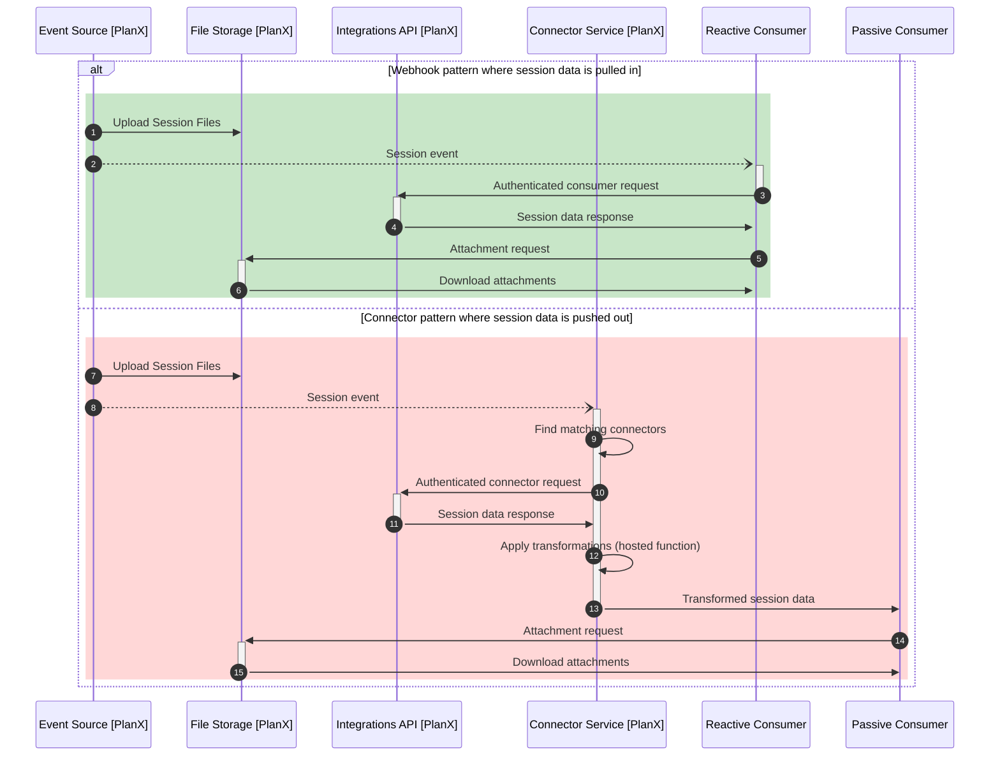

# Integration Patterns

Status: Draft
Date: December 2022

## Context

PlanX allows service designers to create, edit and publish digital services to the public. Where these services have a back-office processing stage, session data must be made available to the appropriate **downstream consumers** (3rd party platforms) after the completion of each **session** (a user's journey through a service). An **integration** is any pattern that allows PlanX to securely pass session data to these downstream consumers when configured to do so by the "Send" component within a service.

The PlanX platform is currently scaling the number of teams using the platform, some of whom will require integrations to downstream consumers which are not currently supported. Open Digital Planning has also announced a fund for integrations with PlanX/BOPs/Digital Land. Both of these factors mean that a clear and robust set of integration patterns is required in the near future.

In order to support various downstream integrations, we require a set of patterns that meet the following design characteristics.

Integration patterns should be:

	* **Open**          	 - teams should be able to pass session data to any 3rd party platform they choose to integrate with.
	* **Reusable**         - where possible, integrations should be reusable between teams.
  * **Configurable**     - integrations should support team level configuration options.
	* **Low Maintainence** - the design should allow the PlanX team to avoid having to make any changes in response to downstream consumer change.
	* **Adaptable**        - the design should enable the session payload to be enriched over time without requiring downstream consumer changes.
	* **Extensible**       - the design should allow the PlanX team to add global "send" integrations (e.g. send to email).
	* **Flexible**         - the design should support the limited capabilities of legacy 3rd party platforms.
  * **Explicit**         - the design should ensure that any 3rd party data access is always explicitly granted by the editors of each individual service (i.e. via the Send component).

Integrations represent the boundary of PlanX services and allow the platform to focus entirely on service design. As such, designing robust interfaces for this function is critical for ensuring team effort remains focused on the core value proposition of the platform and not on supporting and maintaining a growing number of changing integrations.

## Decision

PlanX will expose an **Integration API** that allows consumers to retrieve session data on-demand.

PlanX will notify downstream consumers of the availability of session data via **Webhooks**.

Where downstream consumers cannot support webhooks directly, PlanX can host 3rd party **Connectors** that transform and send session data.

### Overview

The flow for each of these patterns can be described in the following sequence diagram where steps 1 to 6 show the **connector** pattern and steps 7 to 9 show the **webhook** pattern:

```mermaid
sequenceDiagram
    autonumber
    participant Source as Event Source [PlanX]
    participant API as Integrations API [PlanX]
    participant Service as Connector Service [PlanX]
    participant Reactive as Reactive Consumer
    participant Passive as Passive Consumer
    alt Webhook pattern where data is pulled
        rect rgb(200,230,200)
            Source --)+ Reactive: Session event
            activate Reactive
            Reactive ->>- API: Authenticated request
            activate API
            API ->>- Reactive: Session data response
        end
    else Connector pattern where data is pushed
        rect rgb(255, 215, 215)
            Source --)+ Service: Session event
            Service ->> Service: Find matching targets
            Service ->>+ API: Authenticated request
            API ->>- Service: Session data response
            Service ->> Service: Apply transformations (hosted function)
            Service ->>- Passive: Session data
        end
```
[editable diagram](https://mermaid.live/edit#pako:eNqNVNuO2jAQ_RXLT4s2QblsQsjDSqgXaR8qofLQqqUPJhmI1cROfaGliH_vJISwEWRVSyBfzhmfOePMkWYyB5pSDb8siAzec7ZTrFoLgoNZI4WtNqDO65opwzNeM2HISlqVAWGafNjDdf19WTLx9cctfrF8acAvwgBeYLgUut0bJaxA7fn5hndSCMiMVP3mKOszsMzwfUvr58jXtrqXxZJp3aEv0yGYlYZ8gU0h5U8kGgNKkN8FKCA5M4xwTWpblpCf0c1QqJSo3eYh8DwnCPHneZPrcTM6r1x38tiLTDE3FCAFgcbPIaGFMAM9enjcJ-o-P7uNqylZWFNgGJ4hK0dNWF09FhQJw5OmLm2oW3Ft1gp0jS69UgGicwBKDa_qNWaZLu5bFkUOCfzz3xumdc_gTc8uTwUTueI_cpGTipms4GJHDFM7MHqU9_jfXvaO3SgbMWxU4aKuywMxigm9larqvpSHQurm8q0VWbMzGY3kXh7yUMK9UomcOhRfesV4ji3g2GyvKeZawZqmOM1hy2xp1nQtTght2sHqIDKaGmXBobbGyJeOQdMtw9o7FHKOlf90bittd3EofmvfpLxicE3TI_1DUz8Ip9FsHodRHHi-P_PnDj3QdO5NoyBM5lEQh_HMT5KTQ_-2Ebxpknizp_ApiSIviX3PP_0DFlN6mA)

**The Webhook Pattern**:

	* 1 - A session Event is sent to all configured Webhook URLs which match a configured pattern
	* 2 - The downstream consumers react to the webhook and send a corrosponding API request to the Integrations API using their API Key and Secret Token
	* 3 - The Integrations API responds with the requested session data

**The Connector Pattern**:

	* 4       - A session Event is sent to a connector service (internal to PlanX)
	* 5       - The connector service finds matching connections with their associated credentials and configurations
	* 6       - The connector service uses the appropriate credentials to request session data
	* 7       - The Integration API responds with session data
	* 8 and 9 - The connector service executes a stored function that may transform the data and send the data to a passive consumer.

### Webhooks

When an end-user accesses a service, their completed session (at the point of the "Send" component) can be modeled as a simple light-weight event:

```typescript
const sessionEvent = {
	id: "64608023-8592-449b-8fa0-00aed82c734c",
	team: "Open Systems Lab",
	flow: an-application-flow,
	paymentID: "d06ab578-c9d9-4bed-b1b3-0dd6245b7efd",
}

```

This event represents a notification that session data is available for consumption.

It does not contain the session data itself or any personally identifiable information. It only contains data necessary to provide enough context to retrieve the session data from PlanX's Integration API.

#### Configuration

Session events may optionally have a configuration object that is identical for every request made from that configured webhook. This enables teams to pass additional context to downstream services which may be necessary for their own routing and configuration of that request.

```typescript
const sessionEvent = {
	id: "64608023-8592-449b-8fa0-00aed82c734c",
	team: "Open Systems Lab",
	flow: an-application-flow,
	paymentID: "d06ab578-c9d9-4bed-b1b3-0dd6245b7efd",
	config: {
		platformKey: "123",
		teamKey: "abc",
	}
}

```

#### Pattern Matching

Webhooks can be configured to match any combination of team, flow and/or custom configuration variables.

Events will be sent to all webhooks with a matching pattern.

#### Custom Webhooks

A webhook approach like this assumes that vendors can support a single URL to receive events where the handling of that event is determined by the payload. This may not be possible/desirable and vendors may instead prefer to handle events for each team through independent URLs. If this is the case, it may make sense to support team level webhook configurations which allow the team to manually edit a collection of manual webhooks with the relevant configuration fields for each. Custom webhooks may also provide additional flexibility for teams to explore their own integrations.

### Integration API

The PlanX Integration API will expose session data to authorized downstream consumers.

#### Authentication

Consumers must be authorized to access session data for a given team and must not be able to access session data.

Each team will be issued a PlanX **API Key** (key) and **API Secret Token** (secret) for each platform they integrate with. This key and secret pair will be used to access the Integration API and allows the PlanX platform to maintain an audit log of access requests. Key and secret pairs are environment specific (i.e. different values are used in staging and production).

#### Retention Period

Session data will be available from the Integration API for 30 days or for 5 days after the first successful retrieval.

#### Documentation

Documentation for this API will be defined following [OpenAPI Specification v3](https://spec.openapis.org/oas/latest.html) and using the YAML format (which supports a more expressive feature set than the JSON format). This is a [recommended open standard for govenment](https://www.gov.uk/government/publications/recommended-open-standards-for-government/describing-restful-apis-with-openapi-3) and we expext consumers will be familiar with this kind of interface.

Rather than building and hosting our own developer site with this documentation, we will instead use the SaaS tool [Readme](https://readme.com/) which provides a rich developer portal powered primarily by our OpenAPI definition.


### Connector Service

The connector service allows PlanX to manage integrations for legacy services where a reactive webhook pattern cannot be implemented. This option is not recommended but can be used where a webhook approach is not appropriate - for example, for legacy integrations (i.e. Uniform) or for custom integrations which require some additional processing like "send to email".

This service is already nascently present in the PlanX API for processing Uniform and BOPs applications. Some refactoring is needed to enable event-based delegation but existing functionality here will form the basis of the connector service.

The connector service should be able to load and execute any configured connector (hosted function).

#### Connectors (hosted functions)

All hosted function must conform to the following interface:

```typescript
interface Request = {
  get({url: string}): { statusCode: number, response: object }
  post(url: string, payload: object}): { statusCode: number, response: object }
}
type ErrorMessage = string;
type Status = "success" | "failed" | ErrorMessage;
type SessionData = {
  passport: Passport;
  breadcrumbs: Breadcrumbs;
  paymentDetails: Payment;
  // etc...
}
type Connector = ({ session: SessionData, config: Configuration, request: Request }) => Status;
```

Hosted functions are expected to be written and maintained by the vendor they connect to. These functions can be exposed in a simple node module which must be openly published and accessible to the PlanX team for review and installation.

### File Handling

Files are stored on s3 and can be requested directly with a given access key.

[ is this right? ]




## Consequences

  * The integration approach needs to be clearly communicated to possible 3rd party integrators
  * We will want to explore patterns for installing and configuring integrations at a team level
  * We may want to explore how integrations are discovered and shared (i.e. an integration "marketplace")
  * We need to review the Send component UX for adding integrations into a flow to ensure it can support an arbitary number of integration options
  * The Send component needs to know which integration options to present for a given flow. Perhaps it could only showing valid options for that passport schema.
  * Existing Send implementations should be refactored to use the connector service
