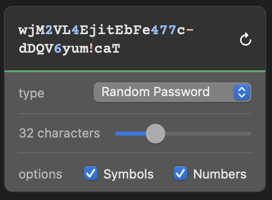

# 4. Secret Generation

Date: 2022-12-07

## Status

Approved

## Context

An integration recently failed when a new secret was generated containing special characters which was not properly escaped. This highlighted the need to have a documented and standard process for generating new secrets.

## Decision

The following process is to be adopted for secret generation - 

1. Generate a new secret using a random password generator, such as 1Password
2. Secrets must meet the following criteria - 
   * Have a minimum length of 32 characters
   * All characters should be alphanumeric
3. Follow [the current process for adding secrets](https://github.com/theopensystemslab/planx-new/blob/main/doc/how-to/how-to-add-a-secret.md) to the application

## Principles
- Staging and Production environments should not share secrets
- Staging and Pizza environments do share secrets
  - This allows Pizzas to interact with other third-party staging environments (such as BOPS staging)
- When required to share a secrets with external partners (e.g. BOPS) this should be done through a secure service such as https://onetimesecret.com/. External partners should also be encouraged to use secure channels to share secrets with us.

## Consequences

This will ensure that we have a repeatable and standard process for generating secrets, which should mitigate further integration failures due to malformed secrets in future.
