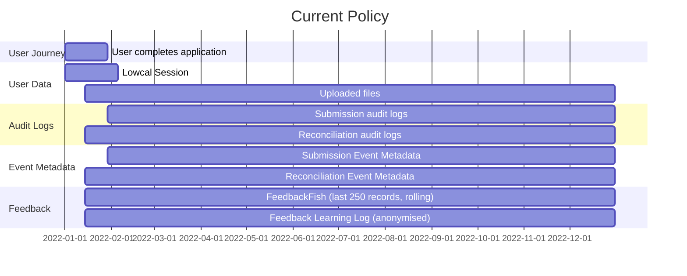
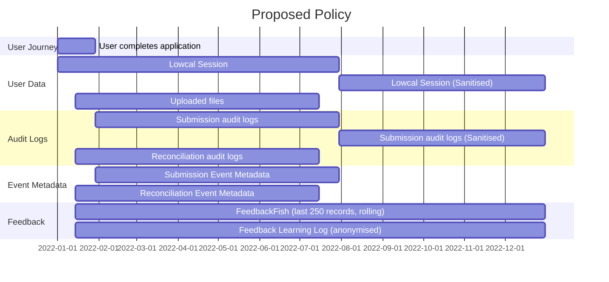

# 5. Data Retention Policy

Date: 2022-12-20

## Status

Accepted

## Context

We have agreed that we need to implement a data retention policy, and the basics of this has been created in [#1325](https://github.com/theopensystemslab/planx-new/pull/1325).

This document and policy specifically covers user data related to applications submitted via PlanX. Further documents will lay out our policies on Flow Data and Analytics.

As part of this, it surfaced that we do not have an agreed and formalised data retention policy which lives outside of the code to serve as a reference.

## Decision
Here are diagrams illustrating our current and proposed data retention policies - 

> Please note that any events hitting the terminal line indicate they are held indefinately

Here are the broad catergory of changes - 

|                    | Current Retention Period                | Proposed Retention Period                                                              |
| ---                | ---                                     | ---                                                                                    |
| **User Data**      | Lowcal Sessions - 7 days, then deleted. | 6 months from submission date, then sanitised and held indefinitely                    |
| **Uploaded Files** | Indefinite                              | 6 months from upload date                                                              |
| **Audit Logs**     | Indefinite                              | Submission Logs - 6 months from submission date, then sanitised and held indefinitely.   Reconciliation Logs - 6 months from submission date, then deleted               |
| **Event Metadata** | Indefinite                              | 6 months from creation date, then deleted                                              |
| **Feedback**       | Indefinite                              | Indefinite

### Timetable
The new policy will be implemented once this proposal has been accepted. This means that records over 6 months old at the point the feature is merged to production will be sanitised or deleted.

An automated scheduled task will run each night to sanitise and delete records which meet the agreed criteria.

### What does "Sanitation" mean?
Currently, we would simply remove / delete and user data (e.g. email, breadcrumbs, passport) whilst retaining the remainder of the metadata associated with a record (such as `id`, `created_at`). This would allow to still have enough information to reconstruct high level user journeys if required to do so for auditing purposes. We would no longer have the fine-grained ability to understand the application question by question.

In future, a more fine grained approach could be implemented to only sanitise personally identifiable data using tags.

## Questions
 - Is 6 months too long?
 - Is there value in retaining reconciliation events indefinately?
 - Files and reconciliation events will be deleted 6 months from their creation, as opposed to 6 months from the submission of their associated applications. This would be an MVP implementation and we could use foreign keys to ensure everything is removed 6 months from application submission. Is this fine for now?

## Consequences

The above approach will offer us the following benefits - 

- A simpler and more standardised approach across categories of user data
- A 6 month period to debug and handle re-submissions with full context
- Indefinite ability to audit and reconstruct user journeys
- Indefinite ability to gather statistics - though we should move towards better capturing events through analytics
