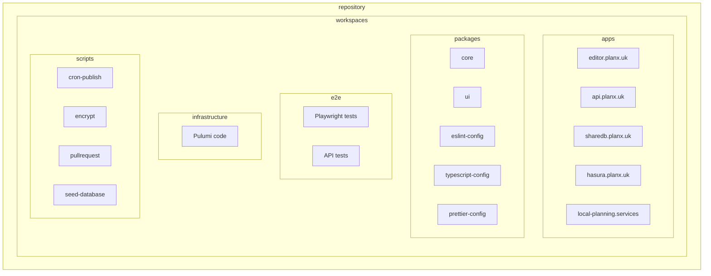

# 10. Migrate to a monorepo structure

## Status
Approved

## Context
Our current repository structure in planx-new consists of - 
- Multiple applications (React app, Express REST API, ShareDB, Hasura) in top-level folders in a pseudo-monorepo arrangement
- A separate external repository ([planx-core](https://github.com/theopensystemslab/planx-core)) containing shared types, utilities, requests, and business logic
- We're using pnpm as our package manager but without workspace configuration

### Current pain points
1. Updating planx-core across multiple projects is slow and error-prone
   - Requires manually updating commit hashes in multiple places
   - Discourages developers from using shared code
   - Slow build and installation times
   - Frustrating round trips of updating planx-core, hitting logical or type issue, updating planx-core...
   - Updating is a frequent developer task - certainly multiple times per week
2. Duplicated build steps, particularly for planx-core, leading to slow build times or caching issues
3. No consistent shared configuration for TypeScript and linting
   - Multiple TS versions, which can lead to bugs or compatability issues
   - Multiple lint rules across projects
4. Limited code sharing between projects (e.g. types, requests)
5. We're planning to add a new application (local-planning.services) that would benefit from sharing UI components with our existing React app
   - This is still TBD - methodology not confirmed here on how this will be built

## Decision
We will transition to a fully configured Turborepo monorepo structure, bringing the external planx-core repository into the monorepo as a package, and setting up proper workspaces using pnpm.

## Rationale

### Why a monorepo?
- **Code sharing**: Easier reuse of components, utilities, and business logic across our applications. It should encourage instead of discourage these behaviours.
- **Atomic changes**: Update shared code and applications in a single commit - this is currently slow and frustrating, and can lead to multiple round-trips of updates, or for breaking changes to be introduced. For example this currently required multiple PRs across multiple repositories with the potential for merge conflicts
- **Consistent tooling**: Unified linting, formatting, and TypeScript configurations
- **Improved developer experience**: Faster feedback loops and simplified local development
- **Better visibility**: Easier to understand project-wide impacts of changes (e.g. updated types, modified tables or data structures can have impacts in the Editor or API which may not have been considered when making the original change)

### Why Turborepo?
- **Incremental builds**: Only rebuild what changed, which should significantly improve build performance
- **Caching**: Local and remote caching to avoid rebuilding unchanged code
- **Relatively simple setup**: Good documentation and lower complexity compared to alternatives (Nx, Lerna)
- **Designed for TypeScript**: Optimized for our primary tech stack
- **Generous free-tier**: Remote caching is free via Vercel (subject to fair use)
- **Solid documentation and examples**: I found these very helpful whilst researching this topic

## Implementation plan

### Phase 1: Setup basic monorepo structure
1. Update PNPM to the latest major version
2. Restructure the existing repository
3. Set up pnpm workspaces configuration
4. Configure basic Turborepo setup with a minimal `turbo.json`
5. Set up shared ESLint, Prettier, and TypeScript configurations as packages
   1. Run linting to resolve any outstanding issues
   2. Fix any blocking TypeScript issues (or temporarily loosed `tsconfig.json` rules if required)
6. Ensure CI/CD pipeline (GitHub actions) is still working as expected
   - At this stage we don't need to try and configure caches (remote or otherwise)
   - This can be revisited at a later stage

### Phase 2: Migrate planx-core
1. Move planx-core into the monorepo as a package 
   - This will not be split into modules (types, models, requests) but will retain it's current structure
   - Again, this can be revisited at a future stage

> [!TIP]
> Existing git history can be preserved use `git mv` and `git merge <REPO> --allow-unrelated-histories`
> 
> **Sources**
>  - https://medium.com/@chris_72272/keeping-git-history-when-converting-multiple-repos-into-a-monorepo-97641744d928
> - https://nx.dev/recipes/adopting-nx/preserving-git-histories

2. Configure shared linting and TypeScript config with current planx-core codebase
3. Archive existing planx-core repository, update `README.md`
4. Migrate planx-core GitHub actions

> [!CAUTION]
> This is probably the point of maximum risk or frustration. If a change will be required to planx-core at this moment in time we'll need to implement it in the original repository (to import into planx-new via commit hash) and later duplicate the change in `planx-new` to maintain feature parity. Ideally we'd aim for a (short) feature freeze in planx-core here, but we'd need to account for bug fixing or required schema updates.

### Phase 3: Migrate existing applications
1. Move the Editor application into the `apps/` directory, import planx-core via workspaces
2. Move the Express API application into the `apps/` directory, import planx-core via workspaces
3. Move ShareDB and Hasura into the `apps/` directory
5. Configure build pipelines in `turbo.json`
6. Configure pre-commit hooks / husky, ensuring this works consistently across projects reading from a single shared set of config files
7. Both `e2e/` and `infrastructure/` will remain as top level folders - these are not packages or applications, but will be treated as their own workspaces
8. Import planx-core via workspaces in `e2e/` and `scripts/`
8. Update `README.md` to explain new structure and tooling

At this stage, we could consider the migration as complete! We will have achieved - 
  - Better co-location of shared planx-core code
  - Improved DX and build times
  - Single linting and TS config across projects

The following steps would very much be a nice to have - 

### Phase 4: Optimize build and CI pipeline
1. Configure remote caching for CI
2. Update GitHub Actions workflows to take advantage of Turborepo
3. Update Docker images to take advantage of Turborepo caches ([docs](https://turbo.build/docs/guides/tools/docker))
   - Without this step, Docker will work the same as it currently does and should not perform any differently
   - Once implemented, it should improve Docker build times  
4. Investigate if we could apply this methodology via Pulumi and Pizzas - we could pull cached builds from Vercel instead of uploading via GHA (potentially a spike?)

### Phase 5: Refactor and restructure planx-core
The planx-core repository is already modularised. If we were to consider each on of these as their own packages (e.g. types, model, requests) we could further improve build and installation times. At this stage we should consider what we'd like to share and how this should be structured.

### Phase 6: Create local-planning.services application
1. Add a new application to the `apps/` directory
2. Extract shared UI components (or even just the MUI theme) to a `@planx/ui` package within the repository
3. Configure it to use the shared UI components
4. Integrate it into the Turborepo build pipeline

## Proposed structure
```
planx-new/
├── apps/
│   ├── editor.planx.uk/
│   ├── api.planx.uk/
│   ├── sharedb.planx.uk/
│   ├── hasura.planx.uk/
│   └── local-planning.services/ (TBD!)
├── packages/
│   ├── core/
│   ├── ui/ (e.g. MUI theme?)
│   ├── eslint-config/
│   ├── typescript-config/
│   └── prettier-config/
├── e2e/
├── infrastructure/
├── scripts/
├── turbo.json
├── package.json
└── pnpm-workspace.yaml
```

### Relationships


## Benefits

1. **Developer experience**:
   - Simplified local development setup
   - Faster feedback loops with incremental builds
   - Consistent code style and quality across projects

2. **Codebase health**:
   - Better abstractions through proper package boundaries
   - Reduced duplication of code and configurations, in particular facilitating shared types and models (finally properly typing a full `Flow`)
   - Clearer dependencies between project components

3. **Build performance**:
   - Improvement in build times through caching
   - Parallel task execution
   - Only rebuilding what has changed

4. **Productivity**:
   - Easier onboarding of new developers with a single repository
   - Simplified contribution to multiple projects, clearer understanding of relationships and consequences of changes
   - Improved knowledge sharing across different project components

## Risks and mitigations

1. **Risk**: Increased complexity in repository structure
   **Mitigation**: Start with a simple Turborepo configuration and add complexity as needed. provide clear documentation

2. **Risk**: Learning curve for the team unfamiliar with monorepo tooling
   **Mitigation**: The repository is already a pseudo-monorepo I'd argue, we're simply introducing tooling here

3. **Risk**: Potential CI/CD pipeline disruption during transition
   **Mitigation**: Implement changes gradually, clearly communicate and plan any breaking changes. Always have a rollback plan.

## Alternative solutions considered

1. **Keeping separate repositories**:
   - Pros: Familiar workflow, no time required to implement, simply move ahead.
   - Cons: Continued issues with shared code updates, which seems to be getting harder / worse over time. Hard to explain to new developers and to onboard them.
  
2. **Publishing planx-core as an NPM package**:
   - Pros: Establishes clear boundaries, allows better versioning.
   - Cons: Compounds issues of slow and frustrating changes, still need to find a better solution for commonly updated and shared code (e.g. types). Would this be another package?

3. **PNPM workspaces**:
   - Pros: Would solve many of the problems outlined here, without much setup.
   - Cons: Implementing proper monorepo tooling would be a likely next step, are we better to take the time and do this properly once? No benefits of improved caching.

4. **Nx Workspace**:
   - Pros: More advanced features than Turborepo. Plugin ecosystem
   - Cons: Higher complexity, steeper learning curve. We likely don't need the more advances features being offered here. Free remote caching being deprecated.

5. **Lerna**:
   - Pros: Well-established tool, comprehensive documentation
   - Cons: Purchased by Nx, less comprehenive cache / build tooling it seems

## Decision consequences

### Positive
- Improved code sharing capabilities, repository structure that encourages this - there's room to simplify the frontend here if we'd like to in future.
- Much less frustrating developer experience and improved CI
- More consistent tooling across projects, single version of TS and ESLint for example
- Scope to share UI or other code packages in future as requirements arise

### Negative
- Initial learning curve for the team, inevitable teething issues
- Temporary decrease in productivity during migration
- Temporary period of time when updating planx-core will be difficult (or certainly worse than the current setup)
