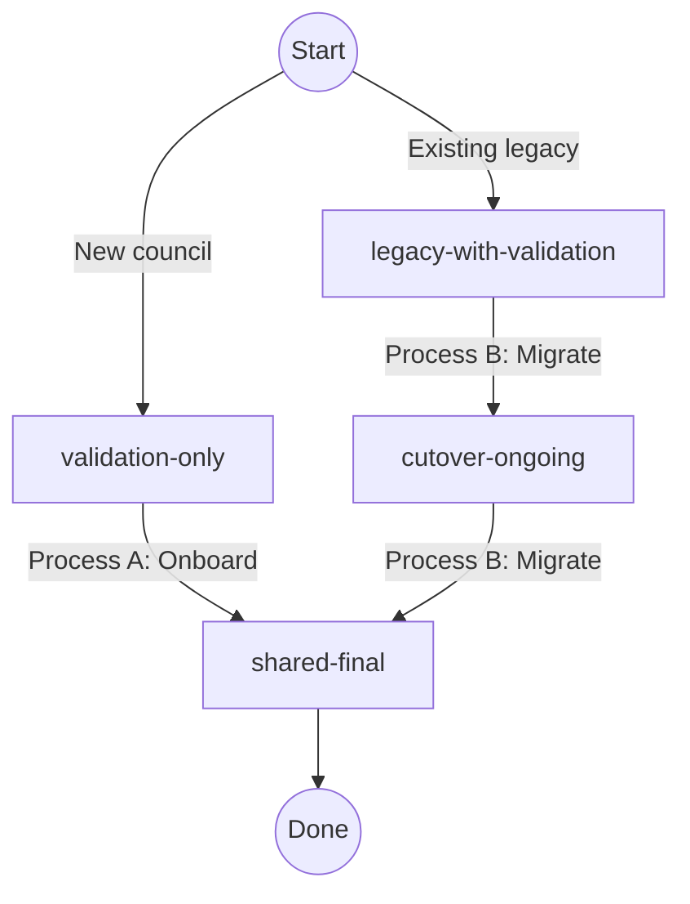

# How to setup custom domains

## Context 🖼️

Teams can access PlanX via a custom subdomain on their own domain (e.g. `https://planningservices.medway.gov.uk/`).

Custom domains are served by a single **shared CloudFront distribution** ("shared CDN") backed by a single **DNS-validated ACM certificate** ("shared cert") that we provision. This replaces the legacy model where each council had its own dedicated CloudFront distribution backed by a council-provided SSL certificate.

Because the shared cert is DNS-validated and managed by AWS, **it auto-renews** - there is no manual renewal (see [Appendix A](#appendix-a-automatic-certificate-renewal)). All a council's IT team ever has to do is add **two DNS records**, which they can add at the same time.

Related links:

- Public-facing [onboarding doc for councils](https://opensystemslab.notion.site/9-Set-up-custom-subdomains-3000ef5212cc43a5a88f46563142f82a) — an abbreviated explanation from their perspective.
- Internal [PlanX CRM on Notion](https://www.notion.so/opensystemslab/Plan-CRM-27c35d469ad1806c8f4dd95067ccf4ff) — tracks the `Auto-SSL` status per council.

> We assume a 1-to-1 relationship between councils and custom domains, and sometimes use the terms interchangeably. We also use "CDN" and "[CloudFront] distribution" interchangeably.

## The lifecycle 🔄

Every custom domain is defined in [`infrastructure/common/customDomains.ts`](../../infrastructure/common/customDomains.ts) - the single source of truth - with a `cloudFrontState` describing where it is in its lifecycle. There are two entry points and one shared destination -



- **Process A** ([onboard a new council](#process-a-onboard-a-new-council)): `validation-only → shared-final`
- **Process B** ([migrate a legacy council](#process-b-migrate-a-legacy-council)): `legacy-with-validation → cutover-ongoing → shared-final`

### What each state actually means for the infrastructure

The state controls which certs and distributions each domain is wired into. The helpers in [`customDomains.ts`](../../infrastructure/common/customDomains.ts) (`getPendingDomains`, `getValidatedDomains`, `getLegacyDomains`) turn the state into infra, so this table is the mental model to hold:

| State                    |       On **mining** cert?        | On **shared** cert? |  Legacy CDN?  |    Alias on shared CDN?    | Live traffic served by               |
| ------------------------ | :------------------------------: | :-----------------: | :-----------: | :------------------------: | ------------------------------------ |
| `validation-only`        | ✅ (surfaces validation records) |          —          |       —       |             —              | not live yet                         |
| `legacy-with-validation` |                ✅                |          —          |      ✅       |             —              | legacy CDN                           |
| `cutover-ongoing`        |                —                 |         ✅          |   ✅ (idle)   | ❌ (deliberately held out) | legacy CDN, until you move the alias |
| `shared-final`           |                —                 |         ✅          | — (torn down) |             ✅             | shared CDN                           |

Two key points from above -

- The **mining cert** (`sslCert-dns-mining`) is a throwaway cert that exists only to surface DNS validation records for domains that aren't yet on the shared cert. It is never attached to any CDN.
- In `cutover-ongoing`, the shared cert already covers the domain, but the domain is **deliberately filtered out** of the shared CDN's alias list (see [`application/index.ts`](../../infrastructure/application/index.ts) — `d.cloudFrontState !== "cutover-ongoing"`). That's because a CloudFront alias can only live on one distribution at a time, and it's still on the legacy CDN. You move it across manually (see Process B) before advancing to `shared-final`.

## The two DNS records 🧭

Every council adds two CNAME records. Send them both at once - they're independent, and both must stay in place forever.

| #   | Record         | Example name                              | Example target                          | Purpose                                                   | Live traffic? |
| --- | -------------- | ----------------------------------------- | --------------------------------------- | --------------------------------------------------------- | ------------- |
| 1   | **Validation** | `_abc123.planningservices.council.gov.uk` | `_def456.acm-validations.aws`           | Proves ownership so ACM can issue and auto-renew the cert | ❌ Never      |
| 2   | **Routing**    | `planningservices.council.gov.uk`         | `d1234abcd.cloudfront.net` (shared CDN) | Points live traffic at the CDN                            | ✅ Yes        |

For a migration, the routing record _replaces_ an existing one (legacy CDN → shared CDN). You can switch it at any point: CloudFront serves each request from whichever distribution owns the alias, so traffic keeps flowing through the legacy CDN until you move the alias - regardless of where the DNS points (see [Appendix B](#appendix-b-cloudfront-routing)).

## Deploy layers & ordering 🚦

| Layer              | How it deploys                                                                       | Notes                                                          |
| ------------------ | ------------------------------------------------------------------------------------ | -------------------------------------------------------------- |
| **`certificates`** | Manually — `pulumi up --refresh --stack production` (see `infrastructure/README.md`) | Provisions the mining and shared certs                         |
| **`application`**  | By CI on merge to `main` / on a `production` rollout                                 | Attaches the shared cert to the shared CDN and manages aliases |

**Ordering:** deploy `certificates` **before** `application` - the application layer imports the shared cert ARN via a Pulumi stack reference, so the cert must exist first.

⚠️ **The one exception:** when _tearing down_ a legacy CDN, delete the distribution first (`application`) and only then the cert it used (`certificates`). Deleting a cert still attached to a live distribution fails.

## Process A: onboard a new council

**Path: `validation-only → shared-final`.** The council has no existing custom domain.

### 1. Add the domain to the source of truth

Pull latest `main`, branch, and add an entry to [`customDomains.ts`](../../infrastructure/common/customDomains.ts):

```ts
{
  name: "a-new-council",              // must match teams.slug in the db
  domain: "planningservices.a-new-council.gov.uk",
  cloudFrontState: "validation-only",  // certificateLocation is not needed
},
```

Set the council's `Auto-SSL` to **In progress** in the [CRM](https://www.notion.so/opensystemslab/Plan-CRM-27c35d469ad1806c8f4dd95067ccf4ff). Commit, and open a PR so the source of truth on `main` stays accurate (get it merged once the entry is stable).

### 2. Deploy `certificates` to mint the validation record

```sh
cd infrastructure/certificates
pulumi up --refresh --stack production
```

This adds the domain to the mining cert as an SAN; ACM generates the CNAME the council must add to prove ownership.

### 3. Send the council both DNS records

Read the validation record:

```sh
pulumi stack output pendingCouncilDnsRecords --stack production --json
```

Get the shared CDN domain for the routing record:

```sh
cd ../application
pulumi stack output customDomainsCdnDomainName --stack production   # e.g. d1234abcd.cloudfront.net
```

Send the council both CNAMEs together.

| Type  | Name                                            | Target                        |
| ----- | ----------------------------------------------- | ----------------------------- |
| CNAME | `_abc123.planningservices.a-new-council.gov.uk` | `_def456.acm-validations.aws` |
| CNAME | `planningservices.a-new-council.gov.uk`         | `d1234abcd.cloudfront.net`    |

### 4. Wait for the validation record, then verify it

Wait for the council to confirm. Then verify the record is actually live (don't rely on the ACM console alone - see [Troubleshooting](#troubleshooting)):

```sh
dig _abc123.planningservices.a-new-council.gov.uk CNAME +short @1.1.1.1
# → returns the ...acm-validations.aws. target once it's in place
```

In the [ACM console](https://us-east-1.console.aws.amazon.com/acm/certificates/list) (region **us-east-1**), the domain on the mining cert should flip from `Pending validation` to `Success`.

> ⏳ Mining certs give up after ~72h of failing to validate and go to `Failed`; a `Failed` cert won't update no matter what the council does. Re-run `certificates` (step 2) to recreate it and restart the clock.
>
> Note: when a cert fails, Pulumi loses track of it, so clean it up manually.

### 5. Advance to `shared-final` and provision the shared cert

Update the entry:

```diff
- cloudFrontState: "validation-only",
+ cloudFrontState: "shared-final",
```

Deploy `certificates` again (as in step 2). This removes the domain from the mining cert and adds it to the shared cert (creating a **new** shared cert; the old one is retained because the shared CDN still relies on it for now).

The `cloudFrontState` values affect provisioning in both the certificates and application layer. Make the change locally (don't merge yet), deploy certificates to provision the new cert, verify it issued correctly, _then_ merge and deploy application in step 7.

### 6. Verify the new shared cert has issued

```sh
cd infrastructure/certificates
pulumi stack output customDomainsCertArn --stack production   # arn:aws:acm:us-east-1:…/<uuid>
aws acm describe-certificate --region us-east-1 --certificate-arn <arn> \
  --query 'Certificate.{Status:Status,SANs:SubjectAlternativeNames}'
```

Expect `Status: ISSUED` and the new domain present in `SANs`. It will show as **not in use** (not yet attached to a CDN) - that's expected.

> This step **fails to issue** if the council we're onboarding hasn't validated, _or_ if any other council already on the shared CDN has since removed their validation record. If it won't issue, identify the unvalidated domain via the cert's `DomainValidationOptions` and chase that council.

### 7. Deploy `application` to attach the cert

Merge your PR to `main` and roll out to `production`. This attaches the new shared cert to the shared CDN (creating the shared CDN first if it somehow doesn't exist yet). Once the council's routing record (sent in step 3) has propagated, live traffic now flows to the shared CDN.

### 8. Add application-level config

In the same PR or a follow-up:

1. **Frontend route detection** - add the domain to `PREVIEW_ONLY_DOMAINS` in [`apps/editor.planx.uk/src/utils/routeUtils/utils.ts`](../../apps/editor.planx.uk/src/utils/routeUtils/utils.ts).
2. **Error reporting** - add a `case` for the domain in `getEnvForAllowedHosts()` in [`apps/editor.planx.uk/src/airbrake.ts`](../../apps/editor.planx.uk/src/airbrake.ts), mapping to `"production"`.
3. **Database** - set `team.domain` to the domain in the Hasura production console (enables payment links and save-and-return URLs to use the custom domain).

### 9. Clean up & finish

- **Old shared cert** - Delete it manually in the [ACM console](https://us-east-1.console.aws.amazon.com/acm/certificates/list?region=us-east-1) (harmless to leave, but they accumulate). Look for an older cert with the same common name to the newly updated one, it will be missing the newly added domain. 
- **Monitoring** - Clone an existing `custom-domains-production` monitor for this domain (preserves Slack SSL-expiry alerts). Login is in the 1Password 'PlanX' vault.
- **CRM** - add the domain under `Custom Subdomain` and set `Auto-SSL` to **Done**.

## Process B: migrate a legacy council

**Path: `legacy-with-validation → cutover-ongoing → shared-final`.** The council already has a dedicated legacy CDN backed by a council-provided cert; we're moving them to the shared CDN + our DNS-validated cert.

The usual trigger is an impending BYO-cert expiry, flagged in the `#planx-notifications-ssl` Slack channel (check dates in the [ACM console](https://us-east-1.console.aws.amazon.com/acm/certificates/list?region=us-east-1)).

> No new councils are onboarded in legacy mode. When the last legacy council is migrated, delete this section.

### 1. Send the council both DNS records

Set the council's `Auto-SSL` to **In progress** in the [CRM](https://www.notion.so/opensystemslab/Plan-CRM-27c35d469ad1806c8f4dd95067ccf4ff).

A legacy council is already on the mining cert (`legacy-with-validation`), so the validation record is already available. Read it, and grab the shared CDN domain for the routing record:

```sh
cd infrastructure/certificates
pulumi stack output pendingCouncilDnsRecords --stack production --json     # validation record

cd ../application
pulumi stack output customDomainsCdnDomainName --stack production          # routing target, e.g. d1234abcd.cloudfront.net
```

Send the council both CNAMEs together - the routing record replaces their existing one:

### 2. Wait for the validation record, then verify it

```sh
dig _abc123.planningservices.an-existing-council.gov.uk CNAME +short @1.1.1.1
# → returns the ...acm-validations.aws. target once live
```

Confirm `Success` on the mining cert in the [ACM console](https://us-east-1.console.aws.amazon.com/acm/certificates/list) (us-east-1). Don't advance until this is confirmed - the next step's cert won't issue otherwise.

### 3. Advance to `cutover-ongoing` and provision the shared cert

Update the entry and commit (open a PR, get it approved):

```diff
- cloudFrontState: "legacy-with-validation",
+ cloudFrontState: "cutover-ongoing",
```

Deploy `certificates` to move the domain off the mining cert and onto the shared cert:

```sh
cd infrastructure/certificates
pulumi up --refresh --stack production
```

> 🚩 **Sanity-check the Pulumi preview before confirming.** A correct run _adds_ an SAN and **replaces** `sslCert-custom-domains` (Pulumi status - `retain[replace]`) - the SAN count should go **up**. If you see the shared cert or mining cert being **deleted outright**, or the SAN count shrinking, you are almost certainly on the wrong Pulumi stack or using the wrong AWS credentials. Do not proceed.

### 4. Verify the shared cert issued and is attached to the shared CDN

First confirm the new cert issued and covers the domain:

```sh
pulumi stack output customDomainsCertArn --stack production
aws acm describe-certificate --region us-east-1 --certificate-arn <arn> \
  --query 'Certificate.{Status:Status,SANs:SubjectAlternativeNames}'
```

Then **deploy `application`** (production rollout) so the shared CDN re-attaches to this new cert. This is essential - until it happens, the shared CDN can't serve the domain and the alias move in step 6 will fail. Confirm the cert now attached to the shared CDN includes the domain:

```sh
cd infrastructure/application
DIST_ID=$(pulumi stack output customDomainsDistributionId --stack production)   # the shared CDN, e.g. E2E8DS0BTP89SI
CERT_ARN=$(aws cloudfront get-distribution --id "$DIST_ID" \
  --query 'Distribution.DistributionConfig.ViewerCertificate.ACMCertificateArn' --output text)
aws acm describe-certificate --region us-east-1 --certificate-arn "$CERT_ARN" \
  --query 'Certificate.SubjectAlternativeNames'
# → the migrating domain must appear in this list
```

### 5. Move the alias from the legacy CDN to the shared CDN

CloudFront won't let an alias live on two distributions, so you move it manually with [`update-domain-association`](https://docs.aws.amazon.com/cli/latest/reference/cloudfront/update-domain-association.html). (Set up AWS CLI SSO first if needed — see `../how-to-setup-aws-sso-credentials.md`.)

Confirm where the alias currently lives (should be the legacy CDN):

```sh
aws cloudfront list-distributions \
  --query "DistributionList.Items[?contains(Aliases.Items, 'planningservices.an-existing-council.gov.uk')].{Id:Id,Status:Status}"
```

Then **fetch a fresh ETag of the target (shared) distribution every time** - it changes on every deploy and is a hash of the current object:

```sh
aws cloudfront get-distribution --id "$DIST_ID" --query '{ETag:ETag,Status:Distribution.Status}'
```

Wait until `Status` is `Deployed` (not `InProgress`), then move the alias:

```sh
aws cloudfront update-domain-association \
  --domain planningservices.an-existing-council.gov.uk \
  --target-resource DistributionId="$DIST_ID" \
  --if-match <fresh-etag>
```

If it errors, see [Troubleshooting](#troubleshooting) - the two common failures (`InvalidArgument` and `PreconditionFailed`) both have simple causes.

> ⚠️ **Once the alias is moved, finish the migration promptly (steps 6–7).** While the domain is still `cutover-ongoing`, it's held out of the shared CDN's alias list - so any `application` deploy that lands now will try to _remove_ the alias you just moved, reverting the cutover. Don't let an unrelated production deploy slip in before you've advanced to `shared-final`.

### 6. Verify traffic has been re-routed

```sh
# The alias should now be owned by the shared CDN, not the legacy one:
aws cloudfront list-distributions \
  --query "DistributionList.Items[?contains(Aliases.Items, 'planningservices.an-existing-council.gov.uk')].{Id:Id}"

dig planningservices.an-existing-council.gov.uk CNAME +short   # → the shared CDN domain
```

Also load the site in a browser and confirm it works. (Note: once the routing record points at the shared CDN, `dig` alone can't tell you which distribution is _serving_ - use the alias ownership check above.)

### 7. Advance to `shared-final` and tear down the legacy CDN

Update the entry - and remove `certificateLocation` if present (it's only used by the legacy CDN):

```diff
- cloudFrontState: "cutover-ongoing",
+ cloudFrontState: "shared-final",
- certificateLocation: "pulumiConfig",
```

Merge and roll out to `production`. This `application` deploy tears down the now-redundant legacy CDN and its imported cert. No app-level config changes are needed — legacy councils already have them.

### 8. Clean up & finish

- **BYO cert artefacts** - depending on where the old cert lived:
  - **AWS Secrets Manager** - delete (or schedule deletion of) the `ssl/[team]` secret in the [console](https://eu-west-2.console.aws.amazon.com/secretsmanager/listsecrets?region=eu-west-2#).
  - **Pulumi config** -
    ```sh
    cd infrastructure/application
    pulumi config rm ssl-<team>-key --stack production
    pulumi config rm ssl-<team>-cert --stack production
    pulumi config rm ssl-<team>-chain --stack production
    ```
- **CRM** — clear the `SSL Expiry Date`, add the domain under `Custom Subdomain`, set `Auto-SSL` to **Done**.

## Troubleshooting

### `update-domain-association` → `InvalidArgument: The request contains an invalid domain name`

The **target (shared) distribution's attached cert doesn't cover the domain** - so CloudFront won't let the alias point at a distribution that can't serve it. It is (almost) never an actual problem with the domain string.

Cause: `certificates` hasn't been deployed since the domain reached `cutover-ongoing` / `shared-final`, or `application` hasn't been redeployed to _attach_ the new cert. Fix by completing Process B step 4 (verify the cert attached to `$DIST_ID` lists the domain) before retrying.

### `update-domain-association` → `PreconditionFailed`

Your `--if-match` ETag is **stale**, or the target distribution is still `InProgress`. The ETag changes on every deploy. Re-fetch it immediately before the call, wait for `Status: Deployed`, then retry (Process B step 5).

### Which distribution currently owns an alias?

```sh
aws cloudfront list-distributions \
  --query "DistributionList.Items[?contains(Aliases.Items, 'planningservices.council.gov.uk')].{Id:Id,Status:Status,Aliases:Aliases.Items}"
```

### `pulumi preview` on `certificates` proposes deletes

If a preview wants to **delete** `sslCert-custom-domains` or `sslCert-dns-mining` (rather than replace/update them), Pulumi thinks the desired domain set is empty or wrong - almost always the **wrong stack** or **wrong AWS credentials**. A correct run _adds_ SANs and _replaces_ certs; the SAN count never shrinks unexpectedly. Stop and check your context.

### `dig` still shows `NXDOMAIN` after the council added the record

This is due to DNS negative-caching. The zone's SOA sets a negative-cache TTL (often 30 min), so a resolver that already saw `NXDOMAIN` keeps serving it. Query a public resolver directly to get a fresh answer:

```sh
dig _abc123.planningservices.council.gov.uk CNAME +short @1.1.1.1
dig _abc123.planningservices.council.gov.uk CNAME +short @8.8.8.8
```

If the validation record name looks wrong, re-pull the expected value with `pulumi stack output pendingCouncilDnsRecords --stack production --json` (the ACM validation name is a stable hash of the domain, so it shouldn't change between cert recreations).

## Appendix A. Automatic certificate renewal

DNS-validated ACM certificates are managed entirely by AWS and **renew automatically** as long as the validation CNAME record remains in the council's DNS. There is no need for any manual intervention once the `shared-final` state has been achieved.

For legacy councils still on BYO certificate (`legacy-with-validation`), the preferred path is to **migrate them to the shared CDN** as above, rather than renewing the BYO certificate.

If you must do the latter, you can find the old howto [here](https://github.com/theopensystemslab/planx-new/blob/356d052450ff24485a90df45b2741614418ccc38/doc/how-to/how-to-setup-custom-subdomains.md).

## Appendix B. CloudFront routing

There are some nuances to the way that CloudFront works which are useful to understand when reasoning about it, not all of which are immediately obvious from the [AWS docs](https://docs.aws.amazon.com/AmazonCloudFront/latest/DeveloperGuide/Introduction.html):

- Aliases (read: domains) are unique across CloudFront distributions globally. That is, no two distributions can be associated with the same alias. Attempting to do so throws a `CNAMEAlreadyExists` error.
- CloudFront domain names in the same AWS account are essentially interchangeable. They act as 'gateways' to the CloudFront network, but the request is handled based on the given `Host`, rather than the specific domain the request is made to.

Some corollaries relevant to our scenario follow:

- We have to move our custom domain manually between two already existing CloudFront distributions, rather than adding the alias to the shared CDN while it's still on the legacy CDN. That is, if we are creating the shared CDN for the first time, we have to spin it up as 'empty' first, rather than provisioning it immediately with the alias.
- While both CDNs are up, the council's DNS `CNAME` record can point at _either_ of them, as long as both are attached to a certificate which includes the custom domain in question. CloudFront will serve the request regardless. That is, once the correct certs are in place, the order in which the alias is moved and the DNS record is replaced is unimportant!
