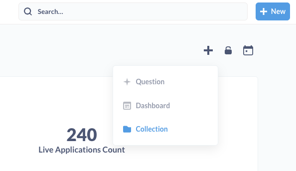
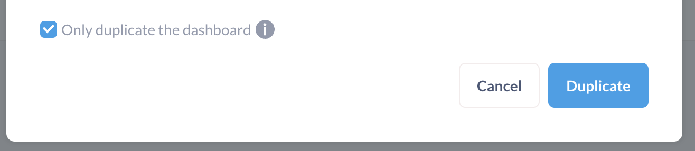
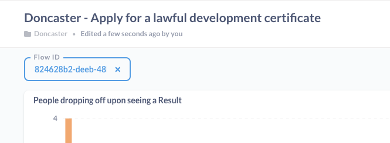
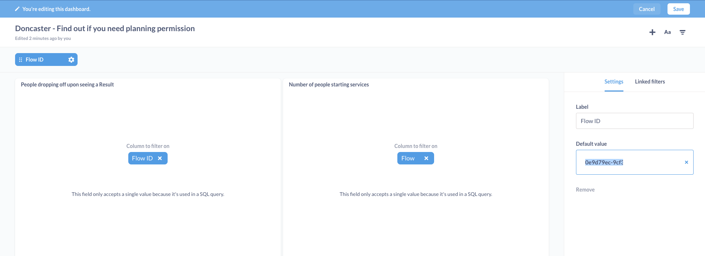
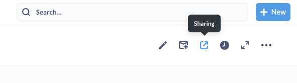
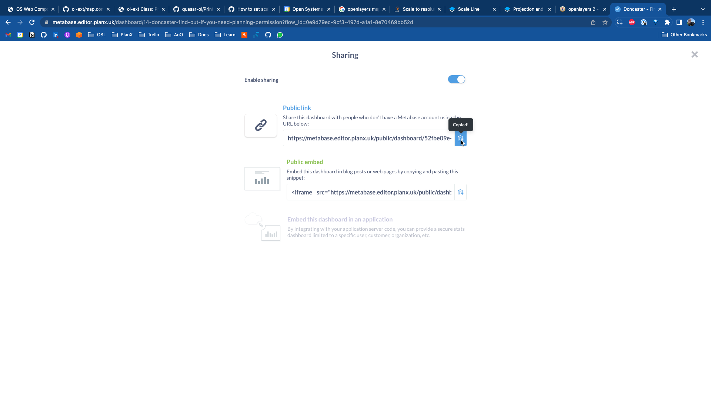

# How to setup a Metabase collection for a new team

## What is Metabase?
[Metabase](https://www.metabase.com/) is an open source BI service which we self-host as part of PlanX. It allows teams to view and self-serve analytics dashboards related to their flows, applications, and users.

Metabase is set up and running on both Staging and Production environments, but only the Production instance (with Production data) has dashboards maintained and curated for teams.


## Process
1. Log into the Production Metabase service at https://metabase.editor.planx.uk/. Login details are stored on the OSL 1Password account.

2. Create new Collection for the team



3. Duplicate existing Dashboards (FOIYNPP, LDC) from an existing team, renaming them and adding to new Collection.



   * Not all teams host the same services on PlanX. Ensure you only duplicate Dashboards for which teams have an associated flows. This can be checked via the PlanX Editor

4. Navigate to the new Collection, and edit each Dashboard to update the FlowID variable.



*Edit Dashboard > FlowID > Default Value > Enter > Done > Save*

This variable ensures that the dashboard is looking at analytics and statistics for the correct flow.

Flow IDs can be obtained via Hasura with the following query, substituting in the `TEAM_SLUG` variable - 

```graphql
query GetFlowIDsForTeam {
  published_flows(where: {flow: {team: {slug: {_eq: <TEAM_SLUG>}}}}, distinct_on: flow_id) {
    flow_id
    flow {
      slug
    }
  }
}
```

5. You should now see the chart update, and the FlowID variable in the top left match the ID for the new team's flow.

6. Enable sharing



7. Share the public dashboard link with the relevant team directly



8. Update "ODP Useful Links" document on Notion
* Link: https://www.notion.so/opensystemslab/Open-Digital-Planning-Useful-links-176e31a4d1274c82959d83fe503d274f
* Dashboards are listed under PlanX > BETA services & analytics > {Council})