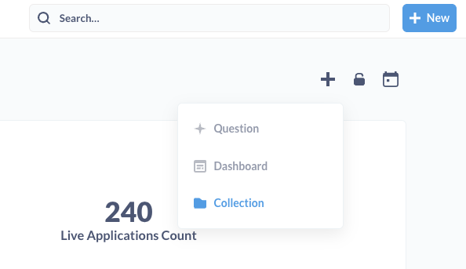
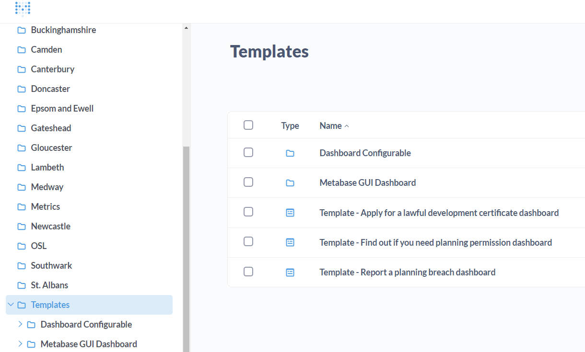
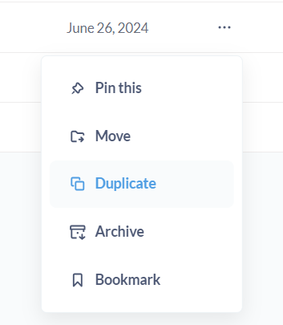
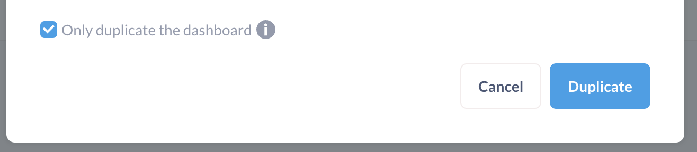
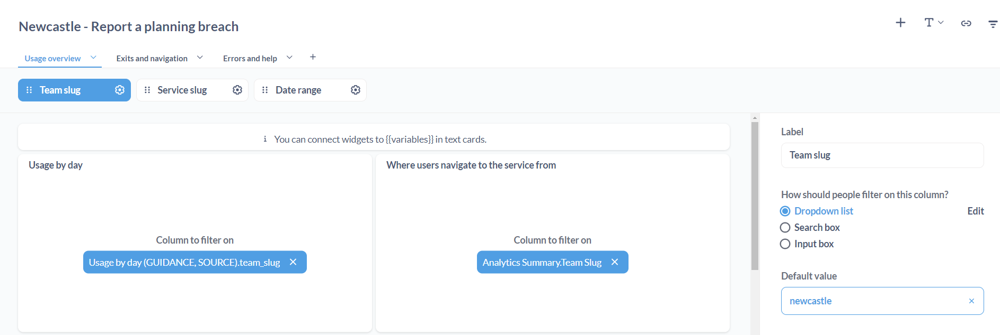
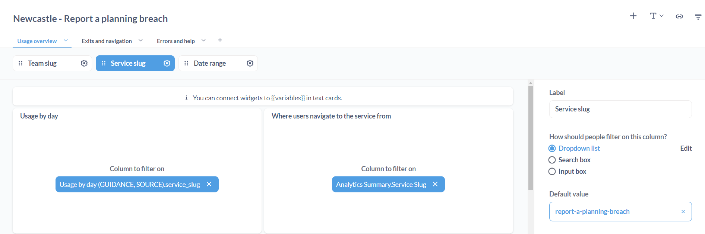
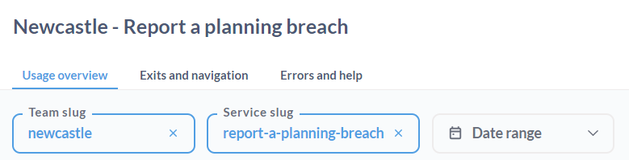
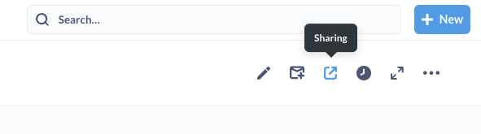
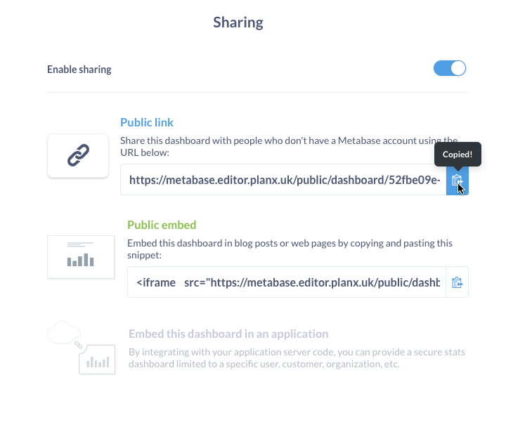
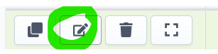

# How to setup a Metabase collection for a new team

## What is Metabase?
[Metabase](https://www.metabase.com/) is an open source BI service which we self-host as part of PlanX. It allows teams to view and self-serve analytics dashboards related to their flows, applications, and users.

Metabase is set up and running on both Staging and Production environments, but only the Production instance (with Production data) has dashboards maintained and curated for teams.

## Context
The Metabase analytics dashboards are currently created per-published service.

We would like to automate this process as much as possible, but currently it is _all manual_. 

This means that each time a council goes live with a service, they let us know (eg via Slack) and we go through the process below.

## Process

To do any of the below, you will need to be logged into the Production Metabase service at https://metabase.editor.planx.uk/. Login details are stored on the OSL 1Password account.

### Setting up Metabase for a new team

_This happens only if a team is new / about to publish their first live service._

1. Check if a team Collection (folder) already exists in Metabase. If not, create a new one. 

### Setting up Metabase for a new Service

_This happens after a team lets us know that a service is going live._

1. Enter the 'Templates' Collection using the navigation bar on the left and duplicate the relevant template, replacing 'Template' with the council name. Duplicate it into the relevant team's Collection (folder).

   * Ensure "Only duplicate the dashboard" is selected. This avoids unecessarily duplicating the visualisations which we maintain, and also means if we need to update anything, the changes will propagate across the dashboards.

   * Not all teams host the same services on PlanX. Ensure you only duplicate Dashboards for public, live flows. This can be checked via the PlanX Editor. We currently only have templates for three services: Find Out If You Need Planning Permission, Apply for a Lawful Development Service, and Report a Breach.

2. Navigate to the new Dashboard to update the team slug and service slug default value variables.

   * Edit Dashboard > \['Team slug' or 'Service slug'\] > Default Value > Enter > Done > Save*

   * This variable ensures that the dashboard is looking at analytics and statistics for the correct flow.

3. You should now see the chart update, and the variables in the top left match the slugs for the new team's flow.

4. Enable sharing by turning the 'Public' link on.

5. Add the dashboard, private and public links to the OSL internal 'Analytics overview' Notion page (PlanX > Analytics overview).

### Adding a public link to the editor

1. Log into Hasura `hasura.editor.planx.uk/console` with Cloudflare WARP on. 

2. Get the flow ID from the editor (with the service open in the editor, view the console: the ID is the code that follows `connecting to...`)

3. In Hasura, go to `public` → `flows` -> `Add` a filter -> `id equals flow ID` -> `Run query` (double check it's the correct flow you've selected). With the selected flow, click on the 'edit' icon. 

4. Add the public Metabase link generated above to the `analytics_link` field and click save. 

The dashboard should now be linked from the editor and the analytics icon should no longer be greyed out. 
