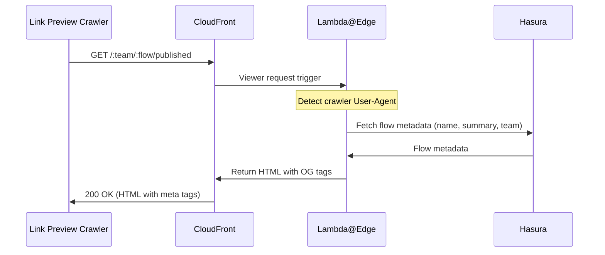
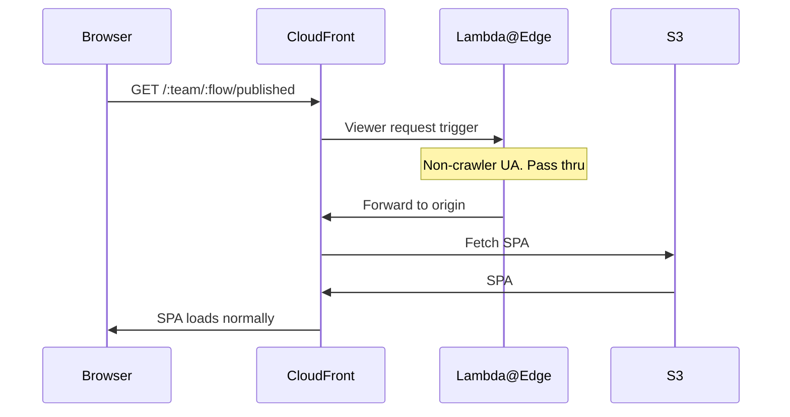
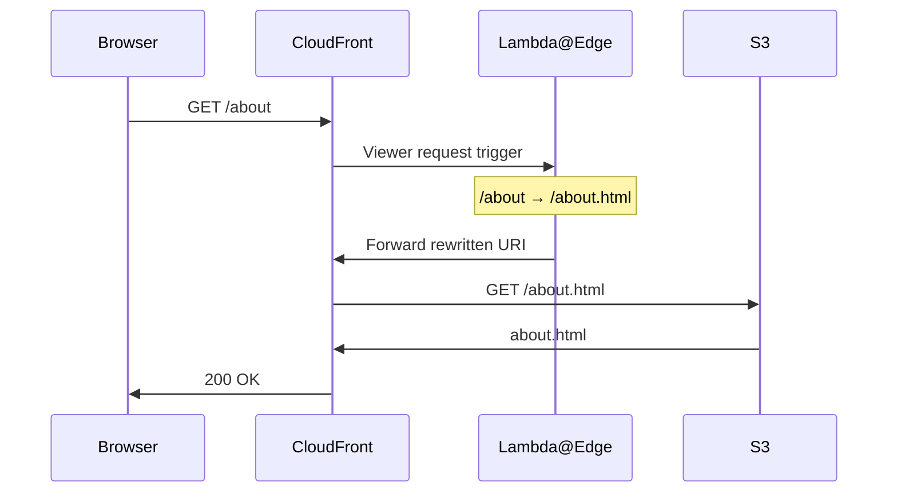

# Flow Link Preview

A [Lambda@Edge](https://docs.aws.amazon.com/AmazonCloudFront/latest/DeveloperGuide/lambda-at-the-edge.html) function that provides rich link previews (OG meta tags) for PlanX flow URLs shared on Slack, Teams, Discord, iMessage, Twitter, etc.

## Overview

This Lambda@Edge function intercepts crawler requests and returns minimal HTML with OG meta tags.

For non-crawler requests, the function passes the original request through without alteration.

### Crawler request



### Normal browser request



## Local testing

Run the test script against a live Hasura instance. `HASURA_URL` defaults to production if not set.

```sh
# Run both default URL types (planx.uk domain + custom council domain)
node --test flow_link_preview.test.js

# Alternatively, run the following from project root -

pnpm test
```

Each URL is tested against multiple scenarios: crawler request, normal browser request, non-flow URL, and (for planx.{dev,uk} URLs) draft/preview variants.

## Deployment

Deployed via Pulumi as a Lambda@Edge function attached to all CloudFront distributions — custom council domains (`planningservices.{council}.gov.uk`) and the main `editor.planx.uk` frontend.

Key constraints:

- Lambda@Edge functions must be created in `us-east-1`
- Viewer-request triggers don't support environment variables — the Hasura URL is inlined by Pulumi at deploy time
- The `__HASURA_URL__` placeholder in `flow_link_preview.js` is replaced per environment

---

# LPS URL Rewrite

A [Lambda@Edge](https://docs.aws.amazon.com/AmazonCloudFront/latest/DeveloperGuide/lambda-at-the-edge.html) viewer-request function that maps the LPS site's pretty URLs to the real `*.html` S3 keys.

## Overview

LocalPlanning.Services (LPS) is a static [Astro](https://astro.build) site served from a private S3 bucket via a CloudFront REST origin (OAI). A REST origin performs no directory-index / pretty-URL resolution, so `/about` maps to an S3 key literally named `about`. Astro (`build.format: "file"`) outputs `about.html`.

Previously the deploy script bridged this gap by stripping `.html` from keys on upload (`about.html` → `about`). That created a key-space mismatch between `dist/` and the bucket, so the static `aws s3 sync --delete` deleted every live page on each deploy and re-created it moments later — a window in which CloudFront served 403/404, recorded by UptimeRobot as downtime on every deploy.

This function moves the mapping to the edge instead, so the site is deployed to S3 **verbatim** (keys === `dist` paths) and `sync --delete` only ever overwrites live objects atomically.



Rewrite rules:

- `/` → `/index.html`
- `/about/` (trailing slash) → `/about.html`
- `/about` (extensionless) → `/about.html`
- Anything with an extension (`/_astro/*.js`, `/sitemap-index.xml`, `/favicon.ico`, an explicit `/about.html`) is passed through unchanged

## Local testing

```sh
node --test lps_url_rewrite.test.js

# Alternatively, run the following from project root -

pnpm test
```

The tests assert the rewritten URI for the root, extensionless pages, trailing-slash pages, the error page key, and asset/`.xml`/`.ico` pass-throughs.

## Deployment

Deployed via Pulumi as a Lambda@Edge function attached to the LPS (`mode: "static"`) CloudFront distribution only.

Key constraints:

- Lambda@Edge functions must be created in `us-east-1`
- The function is config-free, so no placeholder substitution is needed
