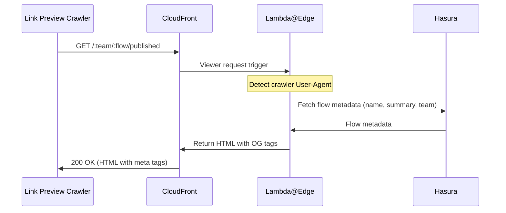
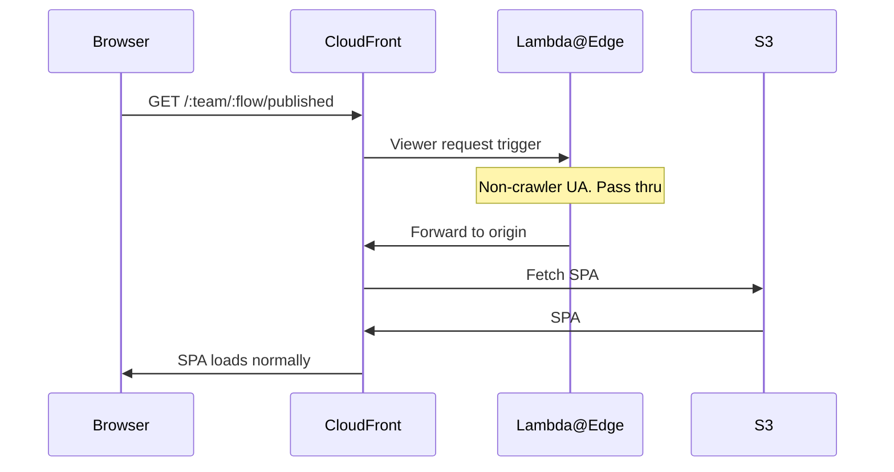

# Flow Link Preview

A [Lambda@Edge](https://docs.aws.amazon.com/AmazonCloudFront/latest/DeveloperGuide/lambda-at-the-edge.html) function that provides rich link previews (OG meta tags) for PlanX flow URLs shared on Slack, Teams, Discord, iMessage, Twitter, etc.

## Overview

This Lambda@Edge function intercepts crawler requests and returns minimal HTML with OG meta tags.

For non-crawler requests, the function passes the original request through without alteration.

### Crawler request


### Normal browser request


## Local testing

Run the test script against a live Hasura instance. `HASURA_URL` defaults to production if not set.

```sh
# Run both default URL types (planx.uk domain + custom council domain)
node test_flow_link_preview.js

# Test a specific planx.{dev,uk} URL
HASURA_URL=https://hasura.editor.planx.dev/v1/graphql node test_flow_link_preview.js https://editor.planx.dev/barnet/find-out-if-you-need-planning-permission/published

# Test a specific custom domain URL
node test_flow_link_preview.js https://planningservices.camden.gov.uk/find-out-if-you-need-planning-permission
```

Each URL is tested against multiple scenarios: crawler request, normal browser request, non-flow URL, and (for planx.{dev,uk} URLs) draft/preview variants.

## Deployment

Deployed via Pulumi as a Lambda@Edge function attached to all CloudFront distributions — custom council domains (`planningservices.{council}.gov.uk`) and the main `editor.planx.uk` frontend.

Key constraints:
- Lambda@Edge functions must be created in `us-east-1`
- Viewer-request triggers don't support environment variables — the Hasura URL is inlined by Pulumi at deploy time
- The `__HASURA_URL__` placeholder in `flow_link_preview.js` is replaced per environment
