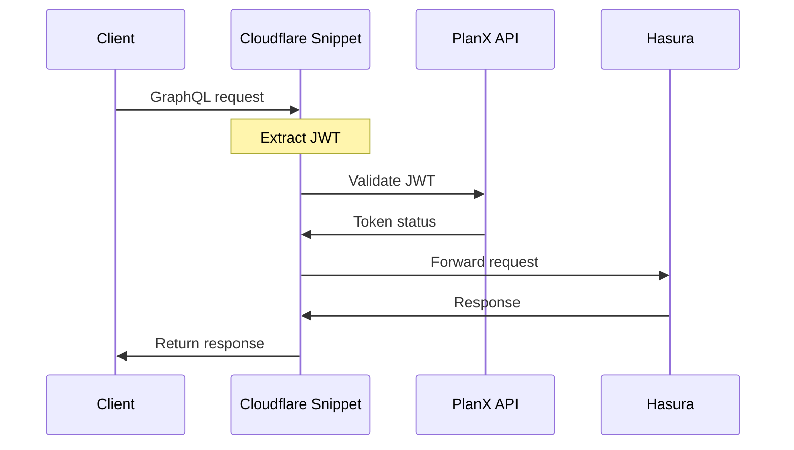
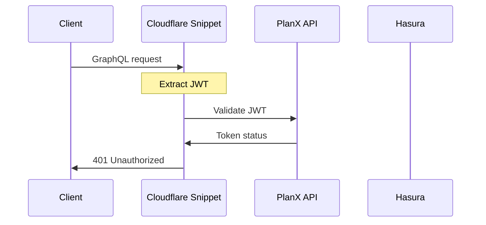

# Hasura Auth Proxy for PlanX Editor

A [Cloudflare Snippet](https://developers.cloudflare.com/rules/snippets/) that acts as an authentication proxy for GraphQL requests to Hasura, validating JSON web tokens (JWTs) before forwarding requests to the Hasura API.

## Overview

This snippet intercepts all GraphQL requests to `hasura.editor.planx.{DOMAIN}/v1/graphql` and:

1. Extracts JWT tokens from either the Authorization header or cookies
2. Validates tokens against the PlanX API authentication service (`/auth/validate-jwt` endpoint)
3. Forwards valid requests to Hasura or returns appropriate error responses

### Request with valid JWT

### Request with invalid JWT

## Deployment

This is currently deployed manually through the Cloudflare Snippets console (Cloudflare > Select domain > Rules > Snippets). 

Please copy/paste the contents of `validate_jwt.js` to a snippet named `validate_jwt` and configure the snippet rule to - 

`(http.request.full_uri wildcard "https://hasura.editor.planx.{DOMAIN}/v1/graphql")`

Be sure to correctly set the environment (`.dev` | `.uk`) based on the Cloudflare domain. This applies to the snippet rule, CF domain, and the `API_URL_EXT` const.

### Future improvements

- [ ] Implement automated deployment via Pulumi ([docs](https://www.pulumi.com/registry/packages/cloudflare/api-docs/snippet/))
- [ ] Write and maintain in TypeScript, generate `.js` file
- [ ] Handle staging / production environments
- [ ] Implement tests